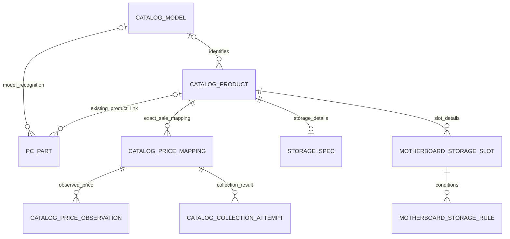

# 국내 데스크톱 카탈로그·가격 DB 확장 설계안

**목표는 국내 데스크톱 사용자의 현재 부품을 식별하고, 호환 조건을 확인한 교체 후보와 같은 승인 가격 자료·관측 시각을 모든 기기에 제공하는 것이다.** 기존 300종을 출발점으로 구형 설치 부품부터 최신 출시 데스크톱 세대까지 지원 범위를 확장한다.

작성일: 2026-10-09. 상태: **모델/상품·공통 ID·SSD/슬롯 구조 구현과 DB 없는 미리보기 준비 완료, 승인한 로컬 MySQL V13·V14 구조 적용 완료**. 실제 제품 채택·자료 적재·신규 가격 수집·배포는 별도 컨펌 대상이다. 구현한 범위와 실행 방법은 [구현·적용 기록](catalog-expansion-implementation-2026-10-09.md), 제품별 연구 자료는 [확장 후보 목록](catalog-expansion-candidates-2026-10-09.md), 기존 자료는 [300종 검토표](../data/catalog-review/catalog-selection-2026-10-09.json)에서 확인한다.

조사 후보는 이전 35종에 최신·누락 모델 43종을 더해 **78종(CPU 41·보드 15·RAM 10·SSD 9·GPU 3)**으로 확장했다. Ryzen AI 400 AM5 6종은 소매/보드 지원 확인을 위해 별도 보류했다. 이는 실제 DB의 제품 수 증가가 아닌 연구 자료의 범위다.

## 1. 확정된 목표와 이번 컨펌 범위

사용자는 국내 Windows 데스크톱 업그레이드 사용자를 우선하기로 했다. 가격에는 **상품가만** 사용하며 배송료·카드 할인·쿠폰·회원 혜택·프로모션을 반영하지 않는다. 기존 가격은 각 PC의 MySQL에 있고, Git pull이나 화면 새로고침으로 공유되거나 새로 수집되지 않는다. 중앙 카탈로그·가격 API와 정기 수집을 도입하는 방향은 합의했으며 아직 구현하지 않았다.

이번 추천안은 최신 CPU·보드와 SSD 구조를 먼저 구현하고, 최신 세대 후보를 우선 검증한 뒤 구형 식별 자료를 추가하는 것이다. 기존 300종·가격 72종·사용자 PC 연결은 보존한다. **사용자는 이 구조의 코드·스키마 작성과 DB 연결 없는 추가 자료 미리보기 준비를 승인했고, 이후 V13·V14 로컬 MySQL 적용도 명시적으로 승인했다.** 구조 적용과 기존 자료 보존 확인은 완료했다. 실제 채택 목록·자료 적재·추가 마이그레이션과 배포는 각각 결과를 보여 준 뒤 별도 승인받는다.

## 2. 지원 범위

‘최근 세대까지’는 발표된 모바일 제품 이름을 데스크톱 교체 부품으로 옮기는 뜻이 아니다. 공식 출시 자료와 제품 페이지에서 확인한 일반 데스크톱 플랫폼을 기준으로 범위를 기록한다. 한 세대의 모든 OEM·산업용·지역 SKU와 모든 제조사의 카드·보드를 이미 수집했다는 뜻도 아니다. 세대별 모델 목록, 기존 항목, 추가 후보와 보류 이유를 따로 관리한다.

| 종류 | 기존 범위 | 보강 범위 | 채택 조건 |
| --- | --- | --- | --- |
| Intel CPU | 12·13·14세대 31종, LGA1700 | 6~11세대 설치 참조, Core Ultra 200S 및 200S Plus | 정확한 모델·데스크톱 구분·메모리 조건; 가격 연결은 판매 구성 별도 확인 |
| Intel 보드 | LGA1700 24종 | LGA1151의 100/200·300 플랫폼, LGA1200, LGA1851 H810/B860/Z890 | 모델 접미사·PCB 리비전·CPU 지원표·BIOS 조건 |
| AMD CPU | AM4 21종·AM5 18종, Ryzen 3000~9000 일부 | 누락된 AM4/AM5 모델과 2026년 X3D 추가 모델; AI 데스크톱은 설치 참조와 소매 구매 구분 | 공식 CPU 모델·소켓·출시 상태; OEM 시스템 발표만으로 단품 구매 가능 판정 금지 |
| AMD 보드 | AM4 22종·AM5 24종 | B840/B850/X870/X870E 모델과 슬롯 지원 자료 | 최신 칩셋이어도 해당 제품 판매 상태와 CPU별 슬롯 조건 확인 |
| GPU | RTX 50·RX 9000·Arc B를 포함한 카드 80종 | 누락 RTX 5050·RX 9060·RX 9070 GRE 카드, 칩 모델 식별 범위 | 칩 이름과 제조사 카드·VRAM·PN을 구분; 지역/OEM 모델은 근거에 따라 별도 보류 |
| RAM | DDR4/DDR5 DIMM 60종, 단품 26·2개 키트 34 | 삼성·SK하이닉스 개별 모듈, JEDEC/OC·전압·clock driver 조건 | 개별 모듈 PN과 키트 PN 구분; 미확정 구간을 정확 SKU로 적재하지 않음 |
| STORAGE | PC 입력 종류는 있으나 카탈로그 제원 모델 없음 | SATA 2.5형·M.2 NVMe PCIe 3/4/5 SSD | 용량·프로토콜·물리 크기·방열판·보드 슬롯 근거 |
| 모니터 | 20종 | 기존 자료 유지, 필요 입력단자 정보 보강 | GPU 출력과 입력단자·해상도·주사율 근거가 있을 때만 연결 판단 |

Intel 공식 Series 2 안내는 200S Plus와 노트북용 200HX Plus를 구분하고, Series 3의 주 용도를 얇고 가벼운 노트북으로 설명한다. 숫자 300이 더 크다는 이유로 교체형 데스크톱 CPU로 등록하지 않는다. [Intel Series 2 안내](https://www.intel.com/content/www/us/en/products/details/processors/core-ultra/series-2.html)

AMD는 2026-04-22 Ryzen 9 9950X3D2 Dual Edition 출시를 발표했다. 이 모델 등 2026년 추가 제품을 기존 Ryzen 9000 목록과 대조한다. 발표·출시 근거와 국내 특정 판매점의 신품 재고 근거는 따로 기록한다. [AMD 출시 발표](https://newsroom.amd.com/news/amd-launches-ryzen-9-9950x3d2-dual-edition-processor/)

PSU·케이스·쿨러는 다음 확장 대상이다. 현재 자료만으로 전체 조립 가능 여부를 보장하지 않는다. GPU 교체 시 실제 PSU·케이블·케이스 여유와 CPU 교체 시 쿨러 장착 규격·냉각 조건은 사용자 확인 항목으로 남긴다. HEDT·서버·노트북·납땜형 미니 PC는 일반 교체형 데스크톱 부품과 구분해 후속 지원 범위를 정한다.

## 3. 현재 구현에서 해결할 문제

| 현재 사실 | 사용자에게 미치는 영향 | 설계 대응 |
| --- | --- | --- |
| 카탈로그 300종, 승인 가격 72종, 가격 없는 제품 228종 | 구형 제품의 가격 부재와 최신 제품의 자료 부족을 동일 오류로 볼 수 있음 | 설치 참조 역할과 구매 후보 역할을 분리하고 가격 상태도 따로 표시 |
| 제품 UUID는 각 DB에서 JPA가 생성 | 같은 외부 제품을 넣어도 로컬 UUID가 달라 중앙 가격을 그대로 연결할 수 없음 | 기존 UUID 보존 + 공통 canonical ID 매핑 |
| CPU·보드·RAM·GPU·모니터 5종 제원만 구현 | SSD 후보를 현행 seed로 바로 적재할 수 없음 | STORAGE 제원·서비스·조회·검증 추가 |
| CPU 메모리 enum은 DDR4/DDR5만 허용 | 6·7세대 DDR3L 조건을 담을 수 없음 | 메모리 세대와 저전압 등급·허용 전압·장착 조건 확장 |
| 현재 `MATCHED`는 제품 연결 여부, 수집기는 AUTO/UNMATCHED 생성 | 칩 모델 또는 CPU 이름만 확인한 항목을 정확 판매 SKU와 혼동 가능 | 모델 확인을 별도 표현, 제품·판매 구성 확인은 추가 근거 필요 |
| 최신 저장 관측 조회, 자동 수집·시간 만료 없음 | 지난 관측이 새로고침 후에도 계속 보임 | 관측 시각 기반 신선도, 수집 실패와 판매 상태 분리 |
| 승인 seed 및 가격 loader에 300/72·BUILDCORES 범위 제약 | 새 제조사 조사 제품을 기존 importer에 억지로 넣으면 식별 혼선 | 기존 묶음 유지 + 별도 승인 추가 bundle·일반화된 식별 경로 |

근거: [CatalogProduct](../backend/src/main/java/com/pcupgradelab/catalog/CatalogProduct.java), [CatalogSpecification](../backend/src/main/java/com/pcupgradelab/catalog/CatalogSpecification.java), [CPU 메모리 계약](../backend/src/main/java/com/pcupgradelab/catalog/memory/CpuMemorySupport.java), [PartInput](../backend/src/main/java/com/pcupgradelab/pc/PartInput.java), [현재 가격 서비스](../backend/src/main/java/com/pcupgradelab/catalog/price/CatalogCurrentPriceService.java), [V12 가격 SQL](../backend/src/main/resources/db/migration/V12__create_catalog_current_price.sql), [가격 import 계약](../backend/src/main/java/com/pcupgradelab/catalog/price/CatalogPriceImportBatch.java).

### 기존 빈값과 검토 과제

94종의 PN 미확인은 이름으로 자동 채우지 않는다. CPU 메모리 최대 용량·채널 수가 부족한 13종, GPU 단자/활성 레인·카드 크기·전력 기준, RAM 높이·ECC·핀 수, 보드 CPU 지원의 UNVERIFIED/BIOS UNKNOWN 자료는 기존 검토표의 항목별 근거를 보강한다. P/E CPU의 단일 baseClock, 내장 그래픽 없는 CPU의 그래픽 모델 등 **조건상 비해당인 null은 오류가 아니다.**

기존 6개 가격 검토 보류와 보드 리비전 미확정 1개를 신규 0원 가격으로 대체하지 않는다. 가격 없음·판매 중단·조회 실패·SKU 미확인을 별도로 표시한다. 현재 실제 사용 표본과 국내 판매 순위는 미측정이므로 ‘많이 쓰는 부품’이라고 단정하지 않는다.

## 4. 모델·카탈로그 항목·판매 매핑의 구조

**모델은 PC 식별용, 카탈로그 항목은 현재 제품 연결용, 판매 매핑은 상품가 연결용이다.** CPU 모델 하나에 정품 박스와 벌크 판매 구성이 있을 수 있고, GPU 칩 하나에는 여러 제조사 카드가 있다. RAM 개별 모듈과 키트 구성은 같은 행으로 취급하지 않는다.

기존 `catalog_product`를 전부 재작성하는 대신 식별 모델을 위에 추가하고, 현재 가격 매핑을 확장한다. 기존 행의 의미가 불명확하면 `LEGACY_UNCLASSIFIED`로 두고 근거를 확인한 행부터 연결한다.

이 그림은 논리 설계다. 기존 `PC_PART.catalog_product_id`에는 DB FK가 없으므로 구현 때 소유권·타입·존재 검사와 삭제 정책을 확인한 후 참조 제약 여부를 결정한다. 모델 관계가 비어 있어도 기존 제품 연결은 유지할 수 있다.

| 대상 | 제안 필드·규칙 | 처음 도입할 때 처리 |
| --- | --- | --- |
| `catalog_model` 신규 | 로컬 `id` PK와 UNIQUE `canonical_id`, 종류·제조사·모델 이름, `model_kind`, vendor/family/series, 출시 상태·일자·플랫폼, 역할, 검토 상태 | CPU_MODEL/GPU_CHIP_MODEL/BOARD_MODEL/RAM_MODULE/RAM_SPEC_GROUP/STORAGE_MODEL을 구분. PN 미확정 RAM 규격군을 정확 모듈로 표현하지 않음 |
| `catalog_product` 확장 | `canonical_id` UNIQUE nullable, `model_id` nullable, `identity_kind`, 설치 참조/구매 후보 역할 | 로컬 `id`와 기존 제원·소스·PC 연결 보존; 분류 근거 없는 행은 LEGACY_UNCLASSIFIED |
| 모델 alias/근거 신규 | 원문·출처·정규화 방법·검토 상태, 충돌 여부 | 띄어쓰기/상표 기호 정규화만 별도 보존. F/K/G/DDR4/WIFI/리비전 접미사를 제거하지 않음 |
| `catalog_model_source` 신규 | 모델 FK·출처·원본 ID·자료 버전·필드별 확인 범위 | 기존 `catalog_product_source`는 제품 FK 전용이므로 모델 전용 근거를 별도로 소유 |
| `pc_part` 확장 | 선택적 모델 참조, SPEC_GROUP/MODEL/PHYSICAL_VARIANT 확인 수준·근거 | 모델 확인만으로 기존 `catalogProductId`나 MATCHED를 설정하지 않음. 옛 저장 자료는 자동 확정하지 않음 |
| RAM 구성 관계 후속 | 카탈로그 키트와 개별 모듈 모델, 개수·PN 근거 | 이미 검증한 키트 PN·moduleCount 유지. 모듈 PN 모르면 구성 관계를 추정하지 않음 |
| `catalog_price_mapping` 확장 | 공통 식별자, 국내 판매 구성·신품 조건·유통 구분, 검토 상태, 판매 단위 | 기존 72개 매핑 보존. 신규 매핑은 용량·PN·방열판·카드/모듈·리비전·판매 단위 검토 후 활성화 |
| 근거 기록 | 출처·확인 시각·문서 위치·확인한 필드·자료 버전·검토자 | 제조사 전체 페이지를 포괄적인 호환 승인으로 쓰지 않음. 원문 발췌 범위 보존 |

`role`은 판매 재고 상태와 독립이다. 설치 참조/구매 후보 둘 다 가능한 모델이 일시 품절돼도 모델을 삭제하지 않는다. 구매 후보 노출에는 판매 SKU 검토, 필요한 호환 근거, 신품 판매 근거와 가격 상태를 함께 사용한다.

PC 입력의 모델·제품 종류는 `PartType`과 일치해야 한다. 두 참조를 함께 받으면 제품의 검토된 모델 관계와 일치하는지 검사하고 다른 모델의 조합은 거부한다. 기존 미분류 제품 링크는 허용하되 새 모델을 임의 추정하지 않는다. 모델 변경·이름/PN 편집으로 기존 제품 연결과 모순되면 사용자 재확인 후 해제하고 UNMATCHED로 표시한다. GPU 칩 모델만 확인한 항목에는 특정 카드의 가격을 확정 표시하지 않는다.

## 5. SSD와 메인보드 슬롯

### SSD 제원

`storage_spec`는 기존 종류별 제원 테이블처럼 `product_id` 1:1로 추가한다. RAM/VRAM의 이진 용량과 SSD 광고 용량의 십진 표기를 구분한다.

| 필드 | 의미·검증 |
| --- | --- |
| `storage_kind`, `capacity_bytes`, `capacity_basis`, 광고 용량/단위 | 첫 지원 SSD. 명목 1TB = 1,000,000,000,000 bytes. PC 수집 actual capacityBytes와 구분 |
| `form_factor`, `m2_length_code`, `connector_key` | 2.5형 또는 M.2 2280 등. 이름으로 키를 추정하지 않음 |
| `bus_interface`, `interface_protocol`, 버전 | SATA/PCIe 버스와 NVMe 등 프로토콜을 분리. SATA 버스를 알고 명령 프로토콜을 모르면 프로토콜 null |
| `pcie_version`, `pcie_lanes` | PCIe SSD에서 근거로 확인. SATA는 비해당으로 null |
| 길이·너비·높이와 `dimensions_basis` | NOMINAL/MANUFACTURER_MAXIMUM/PUBLISHED 구분; 2280을 실물 최대 80×22mm로 간주하지 않음 |
| `heatsink_included`, 변형·PN | 방열판 유무가 다른 상품·PN 구분, 모르면 null |
| 선택 성능·수명 필드 | 순차 속도·TBW 등은 용량별 출처와 시험 조건이 있을 때 보강; 호환 판단의 필수 항목과 구분 |

삼성 지역별 공식 박스 PN과 국내 판매 PN이 같다고 가정하지 않는다. SK하이닉스 PN 미확인과 삼성/SK하이닉스 RAM 범위 후보는 이름만으로 정확 상품을 만들지 않는다.

### 보드 저장장치 지원

보드의 M.2와 SATA 연결은 별도 `motherboard-storage-support` 자료/API로 제공한다. 현재 카탈로그 상세 제원과 `PartInput.specs`에 슬롯 객체 배열을 억지로 넣지 않는다.

| 구조 | 필요한 항목 |
| --- | --- |
| `motherboard_storage_slot` | 보드·리비전·슬롯 이름, M.2/SATA, 키·지원 길이, 허용 버스/프로토콜, 최대 PCIe 세대·레인, CPU/칩셋 연결 경로, 자료 완전성 |
| `motherboard_storage_rule` | 대상 슬롯, CPU 모델/계열 조건, BIOS 조건, 슬롯 비활성·레인 축소·다른 SATA/PCIe 포트 비활성 효과, 출처 |
| 원문 조건 | 구조화하지 못한 조건은 원문으로 보존. 조건 해석이 미완성이면 추가 확인으로 반환 |

예를 들어 ASUS TUF GAMING X870-PLUS WIFI는 CPU 계열별 M.2 지원 및 M.2 사용에 따른 PCIe 공유 조건을 공표한다. 슬롯 개수나 X870 이름만으로 동일 조건을 적용하지 않는다. [ASUS 공식 제원](https://www.asus.com/kr/motherboards-components/motherboards/tuf-gaming/tuf-gaming-x870-plus-wifi/techspec/)

슬롯 고유키는 보드 제품·리비전 키·슬롯 키 조합으로 두고 MODEL/EXACT 리비전 범위와 출처를 보존한다. PCIe 5 SSD와 PCIe 4 슬롯의 세대 차이만으로 INCOMPATIBLE을 반환하지 않는다. 물리·프로토콜·지원 조건과 연결 속도 제한을 구분하며 실제 장착 조건을 확인한다.

## 6. CPU·메모리·호환 판단

LGA1151은 100/200 플랫폼과 300 플랫폼을 구분한다. LGA1200도 보드 지원표에 따라 10/11세대 조건이 달라진다. LGA1700와 LGA1851은 별도 플랫폼이다. 제조사 원문 소켓 표기는 보존하고 표준 플랫폼 코드는 검토해 연결한다. **최종 CPU 지원 여부는 정확한 보드 모델·리비전·CPU 지원표·BIOS 조건으로 판단한다.** [Intel LGA1151 안내](https://www.intel.com/content/www/us/en/support/articles/000025694/processors/intel-core-processors.html), [Intel 10/11세대 안내](https://www.intel.com/content/www/us/en/support/articles/000056574/processors.html)

BIOS 문자열을 사전순·단순 숫자순으로 비교해 최신이라고 확정하지 않는다. 제조사별 버전 이력이 없으면 현행 규칙처럼 ALL 또는 정확한 최소 버전 일치 외에는 추가 확인으로 남긴다. 보드 CPU 목록에서 찾지 못한 항목도 미지원의 확정 근거가 아니다. 기존 [호환 규칙](../backend/src/main/java/com/pcupgradelab/compatibility/CompatibilityRules.java)을 확장한다.

DDR3L은 DDR3 계열의 저전압 등급·지원 전압 조건을 별도로 기록한다. 기존 CPU 메모리 enum과 DB 검증을 확장하되 DDR3/DDR3L 문자열 일치만으로 판단하지 않는다. CPU가 DDR3L 1.35V를 요구하고 보드 자료가 DDR3만 표기하면 전압 근거를 추가 확인한다. 최신 DDR5도 일반 UDIMM/CUDIMM의 clock driver, DIMM 수·rank·JEDEC 지원 속도와 XMP/EXPO 조건을 구분한다. 공표 최대 속도를 모든 장착 구성에 보장하지 않는다.

Intel 메모리 조건에는 **보드의 물리 라우팅 DPC(`boardRoutingDpc`)와 채널당 실제 장착 DIMM 수(`populatedDimmsPerChannel`)를 별도 필드**로 보존한다. 네 슬롯 보드에 두 모듈을 장착했다고 1DPC 배선 보드 조건으로 해석하지 않는다. 각 조건의 정확한 CPU SKU·rank·모듈 종류·보드/BIOS 근거를 확인하기 전 메모리 속도를 확정하지 않는다.

`null`은 미확인이고, 확인된 미지원은 false 또는 근거가 있는 제한이다. 비해당은 필드/프로토콜 조건과 함께 구분한다. 자식 목록이 비었다고 ‘지원 슬롯 없음’으로 해석하지 않도록 `dataAvailable`·`listComplete` 등을 둔다.

| 판단 결과 | 반환 조건 | 사용자 표시 |
| --- | --- | --- |
| COMPATIBLE | 해당 범위의 필수 사실과 지원 근거·조건이 모두 충족 | 확인한 범위와 근거, 장착 시 유의 조건 |
| INCOMPATIBLE | 정확한 슬롯·메모리·지원표 등에서 불일치가 확인됨 | 구체적인 불일치 이유 |
| NEEDS_CHECK | BIOS/리비전/전압/슬롯/PSU/케이스 정보가 부족하거나 근거가 불완전 | 추가로 확인할 항목 |

판정에는 `scope`, 적용 규칙, 근거, 미확인 조건을 함께 반환한다. CPU와 메모리의 확인만으로 PC 전체를 COMPATIBLE이라고 표시하지 않는다. QVL에서 찾지 못한 항목도 자동 INCOMPATIBLE이 아니다. 이름 정규화와 후보 제시를 먼저 구현하고 자동 최종 연결은 근거 기준을 충족하는 항목부터 제한적으로 도입한다.

## 7. 공통 ID와 공유 API

프론트의 가격 요청 주소만 중앙 서버로 바꾸면 로컬 UUID와 중앙 UUID가 달라 기존 PC 연결·호환 API에 문제가 생긴다. **로컬 백엔드를 연결 창구로 두고 canonical ID로 중앙 카탈로그/가격을 조회하는 방식을 추천한다.** 회원 로그인·PC 구성·스캔은 기존 로컬 개발 서버 규칙을 유지하며 이 단계에서 중앙 가격 서버로 개인 PC 데이터를 보내지 않는다.

1. 승인된 외부 출처·external ID와 공통 canonical ID의 매니페스트를 만든다. 공통 ID는 중앙 또는 승인 bundle에서 한 번 부여하고 모든 PC에서 공유한다.
2. 기존 제품은 검토한 출처 식별자로 로컬 UUID에 공통 ID를 연결한다. 이름만으로 병합하지 않는다. 중복·충돌은 미리보기에서 중단한다.
3. 추가 카탈로그는 canonical ID로 멱등 upsert하되 로컬 ID와 사용자 연결을 유지한다. 신규 제조사 조사 제품에 임의 BuildCores ID를 만들지 않는다.
4. 로컬 백엔드가 로컬 ID→canonical ID로 중앙 가격을 요청하고 화면에는 기존 로컬 ID에 맞춰 응답한다. 가격·확인 시각·자료 버전은 중앙 응답에서 제공한다.
5. 중단된 중앙 연결은 마지막 성공 시각을 함께 표시한다. 오래된 캐시를 당일 가격으로 표현하지 않으며 요청 실패로 0원이나 품절을 만들지 않는다.

| API | 제안 |
| --- | --- |
| 기존 `/api/catalog/products`와 상세·CPU/메모리 지원 | 현재 로컬 ID 계약 유지, optional canonical ID·식별 수준·역할 확장 |
| 신규 `/api/catalog/models` | 모델 검색·별칭·확인된 제품 후보를 제공. 모델 조회가 제품 MATCHED 변경을 수행하지 않음 |
| 신규 `/api/catalog/products/{id}/storage-support` | 보드 슬롯·CPU/BIOS/공유 조건, 자료 완전성·출처 |
| 중앙 `/api/v1/catalog/products/{canonicalId}` 및 버전 목록 | 승인 카탈로그와 변경 버전 조회; 미검토 후보는 공개 구매 추천과 분리 |
| 중앙 `/api/v1/prices?productIds=...` | ID별 승인 상품가·판매 단위·출처·관측 시각·신선도·판매/조회 상태; 묶음 기준 시각·자료 버전도 제공 |

PC API의 CurrentUser·소유권·다른 회원 PC 404·CSRF·세션 규칙을 유지한다. PartInput/ScanDtos/프론트 타입/수집기/규격 문서를 함께 갱신한다. 수집기 AUTO 결과와 사용자 MANUAL 항목 보존·덮어쓰기 확인·로그인 후 초안 자동 저장 금지 규칙도 유지한다.

## 8. 가격 수집·현재가 결정

일반 상품가 관측은 기존 `catalog_price_observation`에 이어 저장하고, 새로고침은 승인된 중앙 관측을 조회한다. 매핑의 정확한 상품 구성과 판매 단위 검증을 먼저 하고 정기 수집 대상으로 등록한다. 기존 72개 관측의 시각을 최신 날짜로 바꾸지 않는다.

현행 관측 테이블에는 승인 상태가 없으므로 **이후에도 승인한 가격만 observation에 넣는다.** 검토 대기 금액·근거 URL·원래 관측 시각·PENDING/ACCEPTED/REJECTED 결정은 신규 collection_attempt에 보관한다. 승인 시 원래 관측 시각으로 관측을 추가하고 승인 시각은 별도로 기록한다. 보류 금액은 현재 최신 관측 쿼리에 들어가지 않는다. 현재 실제 DB에 승인 스냅샷 외 자료가 있으면 적용 미리보기에서 따로 제시하고 자동 승인하지 않는다.

추천 운영값은 **매일 09:00 Asia/Seoul 수집**, 저장 시각 UTC, **관측 후 48시간 경과 시 경고, 7일 경과 시 구매 총액에서 제외**다. 48시간/7일 경계는 `age >= threshold`로 일관되게 계산한다. 일정과 임계값은 설정값으로 관리하고 테스트에 기준 시각을 주입한다. 이 문서는 작업 스케줄러를 생성하지 않는다.

| 구조·상태 | 처리 |
| --- | --- |
| `catalog_collection_attempt` 신규 | 매핑·job ID·시도/성공 시각·수집 결과·파서 버전·오류 요약과 검토 대기 금액/근거/원래 관측 시각·승인 결정/시각 기록 |
| 판매 가능 근거 | AVAILABLE/NO_ACTIVE_OFFER/UNKNOWN을 조회 실패와 분리. 최근 승인된 판매점 링크·확인 시각을 기록. 국내 모델 페이지가 있다는 사실만으로 AVAILABLE 확정 금지 |
| 신선도 | 승인된 가격 관측 시각을 기준으로 FRESH/STALE/EXPIRED, 가격 없는 경우 NO_PRICE. 이전 관측은 이력 유지 |
| 미수집·품절 | 0원 생성 금지. 정확히 확인된 NO_ACTIVE_OFFER이면 이전 가격은 과거 관측으로 표시하며 현재 구매 총액에서 제외 |
| 대표가 | 정확히 검토한 동일 상품 구성에서 확인되는 일반 신품 상품가. 정품/벌크/병행·키트/단품 가격을 서로 섞어 최저가로 비교하지 않음 |
| 급변·오식별 | SKU 변경·용량/구성 변화는 자동 반영 중단. 승인 가격이 30% 이상 변하면 우선 검토 대기; 실제 가격 변동으로 확인한 후 관측 승인 |
| 실패·재시도 | 일시 오류는 최대 2회 추가 재시도와 간격 설정. 작업 중복 실행 잠금·멱등 key·요청 간격·허용 소스별 정책 적용 |
| 작업 확인 | 마지막 성공·오류 수·가격 없는 구매 후보·오래된 관측·검토 대기 항목을 운영 화면/보고서에서 확인 |

판매 상태는 매핑/소스별로 저장한다. 한 소스의 NO_ACTIVE_OFFER는 다른 검토된 동일 구성 매핑의 판매 가능 여부를 덮어쓰지 않는다. 조회 실패가 이어져도 이전 판매 상태의 확인 시각을 갱신하지 않으며 과거 근거임을 표시한다. 검토 승인과 관측 추가는 한 트랜잭션으로 처리하고 매핑·원래 관측 시각의 중복을 막는다.

30% 급변 임계값과 재시도 횟수는 초기 **제안값**이며 수집 운영 구현 전에 실제 샘플로 조정하고 컨펌받는다. 첫 관측에 비교값이 없으면 SKU 검토와 수집 근거를 확인한 후 승인한다. 배송료·조건부 할인·프로모션 필드를 수집 가격에 더하거나 빼지 않는다. HTML의 ‘최저가’ 숫자가 배송료를 포함하면 그대로 상품가로 쓰지 않고 일반 상품가 원문을 따로 검증한다.

여러 매핑을 쓰는 후속 단계에서는 매핑별 최신 승인 관측과 판매 상태·신선도를 먼저 판정하고 **동일 판매 구성**의 유효 상품가 중 최소값을 대표가로 선택한다. 관측 시각 동률은 결정적인 ID 순서로 처리한다. `catalog_reference_price`의 장기 기준가격은 별도 목적의 자료로 유지한다.

RAM 가격은 판매 단위 전체 금액이다. 현행 계약은 RAM 단품도 RAM_KIT/moduleCount=1로 표현하며 키트는 검증한 개수가 제원과 같아야 한다. 기존 코드가 개당 환산값을 보여 주더라도 이를 단품 구매 가능 금액으로 사용하지 않는다. 구매 총액은 실제 구매할 완전한 판매 단위 수를 기준으로 계산하고, 필요한 장치 수와 판매 구성 대응이 불명확하면 합산하지 않는다.

국내 정식 유통 신품을 신규 대표가의 우선 대상으로 제안한다. 벌크/병행도 지원할 때는 별도 매핑과 표시로 보존하고 어떤 구성을 대표가로 쓸지 가격 등록 단계에서 확인한다. 이번 설계 승인만으로 새 판매 SKU·가격을 승인하지 않는다.

## 9. 적재·전환 순서와 완료 기준

| 단계 | 작업·산출물 | 완료 기준 | 필요한 컨펌 |
| --- | --- | --- | --- |
| 0. 현재 | 최신 출시 범위·후보 원자료·이 설계안 | 중복·용량 단위·근거·미확인 상태 검증, 독립 설계 검토 | 다음 단계 추천안 승인 |
| 1. 구조 구현 | 공통 ID·모델 관계·역할·STORAGE·보드 슬롯, API/프론트 계약, V13/V14; 메모리 조건은 후속 | 기존 300/72 importer 동작 유지, H2/API/프론트 검사 통과, 실제 DB 실행 전 변경량 제시 | 구현·미리보기 준비 승인됨; 실제 적용 미승인 |
| 2. 최신 후보 승인 자료 | Intel 최신·AMD 최신 모델/보드·GPU 누락 카드·SSD 우선, 이후 구형·RAM PN 보강 | 정확 항목과 미확정 모델 구간 분리, 출처·canonical ID·제원·리비전·호환 조건 검증 | 실제 채택할 제품/판매 SKU 목록 컨펌 |
| 3. 로컬 DB 적용 | 스키마 먼저, 승인 bundle 별도 적재·검증 보고 | 기존 UUID·PC 연결 보존, 재실행 멱등성·실제 MySQL 검증·백업/복구 절차 확인 | bootRun/Flyway와 실제 적재 각각 승인 |
| 4. 중앙 공유 연결 | 승인 카탈로그와 가격 읽기 API·로컬 adapter·관측 신선도 | 두 개발 PC에서 같은 canonical ID의 금액/시각/상태 일치, 장애 시 정상 표시 | 배포 위치·비용·운영 계정·배포 승인 |
| 5. 정기 가격 운영 | 등록 SKU의 정기 수집·승인·이력·실패/품절·운영 보고 | 상품가/할인 구분, 48h/7d·0원 방지·급변 검토·중복 실행 검사 | 수집 소스/대표 판매 구성·운영 제안값 컨펌 |

사용자는 단계별로 확인한다. 단계 1 승인 후에도 단계 2~5의 실제 DB 변경·판매 SKU 채택·가격 적재·배포를 한꺼번에 실행하지 않는다. 이미 적용된 V1~V12는 수정하지 않고 새로운 다음 버전 마이그레이션을 작성한다. pull·일반 build/test·일반 서버 실행으로 카탈로그와 가격 자료가 자동 적재되게 만들지 않는다.

### 검증할 중요한 사례

- 기존 PC와 제품 UUID를 유지하면서 동일 공통 ID를 두 DB에 연결하고, 같은 중앙 가격 응답으로 표시할 수 있다.
- 모델만 확인한 GPU/CPU와 모듈 PN 미확인 RAM은 정확 제품·판매 SKU가 승인됐다고 표시되지 않는다.
- DDR4/DDR5 보드 접미사·리비전, LGA1151 플랫폼, BIOS 미확인, DDR3L 전압과 CUDIMM 조건을 무시한 확정 결과가 없다.
- SSD 명목 1TB와 실제 수집 용량을 구분하며, SATA/NVMe·M.2 길이·CPU별 슬롯 비활성·공유 제약을 확인한다.
- null/false/비해당·불완전한 빈 슬롯 목록을 구분하고 근거가 부족한 판정은 NEEDS_CHECK다.
- RAM 2개 키트의 관측을 단품 판매가로 오표시하거나 필요 개수에 무조건 곱하지 않는다.
- 수집 실패·0원 페이지·품절·SKU 변경·급변·48시간/7일 경계·중앙 연결 중단이 서로 다른 상태로 보인다.
- 기존 로그인·소유권·CSRF와 수집기 원문/장치별 용량·MANUAL 보존·AUTO 덮어쓰기 확인이 유지된다.

문서·연구 단계 뒤 사용자가 승인한 구조를 구현하고 H2 백엔드 테스트와 프론트 test/lint/build를 수행한다. 결과는 [구현·미리보기 기록](catalog-expansion-implementation-2026-10-09.md)에 기록한다. 실제 MySQL·Windows 수집기 통합 검증은 승인된 별도 실행 결과로 보고한다.

## 10. 효과 측정과 후속 컨펌

실제 사용자 동의 표본에서 CPU/보드/RAM/GPU/저장장치별 **모델 확인률과 정확 변형/모듈 PN 확인률을 따로 측정**한다. 식별 불가 원문 중 개인 식별 정보·일련번호·토큰을 제거한 자료만 후보 보강에 사용한다. 표본 수·국내 사용 빈도·판매 수요는 현재 미측정이다.

구매 후보는 등록 개수보다 **정확 판매 구성 + 해당 범위의 호환 근거 + 현재 국내 신품 판매 근거 + 유효 상품가/시각**을 모두 충족하는 비율로 평가한다. 구형 설치 참조에는 신품 가격을 강제로 채우지 않는다.

단계 1의 구현·미리보기 준비는 승인됐다. 다음 컨펌은 **최신 우선 52종의 근거를 보강해 제시한 실제 채택 목록**이다. 실제 적재 제품, PN 미확정 항목의 채택, 신규 가격 판매 구성, 중앙 서버 위치·비용과 정기 수집 세부값은 해당 산출물을 준비한 단계에서 확인한다.
